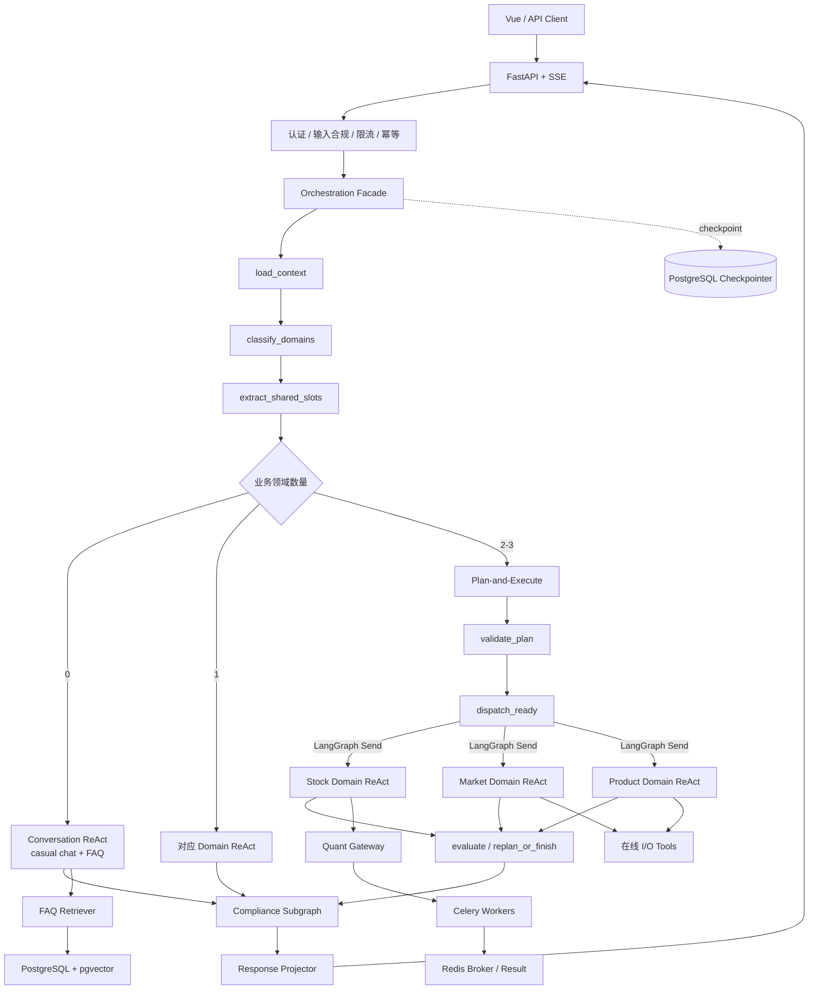

# LangGraph 分层混合 Agent 编排重构设计

日期：2026-09-14
状态：已由用户确认

## 1. 背景

FinanceAgent 已具备 LangGraph 主流程、Supervisor、股票/市场/产品处理逻辑、PostgreSQL Checkpointer、Redis 会话记忆、任务 DAG 和输出敏感词检查。然而现有实现仍有以下结构性问题：

- 所有意图进入同一条固定主图，简单问答与复杂研究没有清晰的执行模式差异。
- Supervisor 同时承担分类、任务生成和输出拼装，领域目标与顶层意图混杂。
- 股票、市场和产品以 Agent 类存在，但多数业务逻辑实际是确定性 pipeline，不需要独立自治 Agent。
- CPU 密集计算仍在 Web 进程或线程池中执行，不能独立扩缩容，也不具备真正的异步恢复能力。
- 输出合规逻辑分散在 Supervisor 合成和入口代码中，不是所有终态都必经的图节点。
- 当前 checkpoint `thread_id` 只使用 `conversation_id`，缺少显式用户隔离。

本次采用渐进式迁移：保留现有 HTTP、SSE 和前端响应契约，通过稳定 seam 替换内部编排，不进行一次性重写。

## 2. 目标

1. 用 LangGraph Root Graph 统一承载 Supervisor 的分类、路由、规划、调度和汇总。
2. 将 Supervisor 的业务意图收敛为三个领域：`stock_research`、`market_insight`、`product_research`。
3. 将没有命中业务领域的 casual chat 与投资规则 FAQ 交给 Conversation ReAct。
4. 单业务领域请求直接进入对应 Domain ReAct；复合领域请求进入 Plan-and-Execute，再调度 Domain ReAct。
5. 股票、市场和产品不实现为专门 Agent 类，而实现为可独立编译和测试的 LangGraph 领域子图。
6. LLM 只负责理解、规划、工具选择和受约束叙述；事实获取、评分、指标、筛选和回测由确定性工具完成。
7. 通过 Celery 隔离 CPU 密集计算，并支持同步预算内等待、异步查询和 checkpoint 续跑。
8. 所有输出经过统一合规子图。
9. 使用 State 与 PostgreSQL Checkpointer 支持多用户多会话、断点恢复和审计。

## 3. 非目标

- 首版不建设 FAQ 管理后台。
- 首版不把行情和数据库查询等 I/O 任务迁入 Celery CPU 队列。
- 首版不替换现有股票研究规则、产品规则、行情 Provider 或研究结果口径。
- 首版不允许 Domain ReAct 自由调用跨领域工具。
- 首版不改变现有 `/api/chat`、`/api/chat/stream` 的主要响应字段。

## 4. 总体架构



职责分离：

- Supervisor 决定“属于哪个业务领域、是否需要跨领域规划”。
- Planner 决定“跨领域任务、依赖、预算和期望结果”。
- Domain ReAct 决定“为完成本领域目标，应调用哪些本领域工具”。
- 确定性工具负责事实与计算。
- Compliance Subgraph 负责唯一输出出口。

## 5. 路由模型

Supervisor 只输出三个业务领域的集合：

```python
BusinessDomain = Literal[
    "stock_research",
    "market_insight",
    "product_research",
]
```

“分析、推荐、比较、筛选、查询”等不再是 Supervisor 总意图，而是领域请求的 `goal`。

| 识别结果 | 执行模式 |
| --- | --- |
| `domains == []` | Conversation ReAct，处理 casual chat 与 FAQ |
| `len(domains) == 1` | 直接进入对应 Domain ReAct |
| `len(domains) >= 2` | Plan-and-Execute，计划任务调用 Domain ReAct |
| 低置信度且缺少必要信息 | 输出结构化澄清问题，不进入执行子图 |
| 分类协议错误或模型不可用 | 明确失败或安全降级，不静默猜测业务领域 |

## 6. 深模块与 seam

### 6.1 `AdvisorOrchestrator`

唯一外部 seam。保留现有同步和流式调用方式，内部负责生成运行标识、加载状态、调用编排图并投影兼容响应。FastAPI 不感知 ReAct、Planner、Celery 或 Checkpointer 的实现细节。

### 6.2 `ExecutionRouter`

输入当前消息和会话上下文，返回强类型 `RoutingDecision`。只判定领域、模式和澄清需求，不执行工具。

### 6.3 `ConversationReActGraph`

处理 casual chat 与投资规则 FAQ。只允许会话工具和 `search_faq`，最多四个 ReAct 循环。

### 6.4 三个 Domain ReAct 子图

- `StockDomainGraph`：分析、推荐、比较、主题筛选。
- `MarketDomainGraph`：大盘、情绪、资金面、政策事件。
- `ProductDomainGraph`：查询、分析、推荐、比较、适配度。

三个领域都以 LangGraph 子图实现，不保留独立业务 Agent Loop 或 Agent 类。每个子图拥有私有 State 和工具白名单，只向根图投影统一 `DomainOutcome`。

### 6.5 `PlanExecuteGraph`

仅处理两个或三个业务领域同时出现的请求。Planner 负责跨领域分解和依赖，不规划领域内部工具调用。计划经验证后由 LangGraph `Send` 统一扇出全部就绪任务；股票、市场和产品分支使用相同调度协议，不允许领域专用旁路。

### 6.6 `QuantGateway`

提供 `submit`、`status`、`result` 三个稳定操作。Celery 是生产 Adapter，测试使用内存 Adapter。领域图不直接依赖 Celery。

### 6.7 `FaqRetriever`

提供 `search(query, top_k)`，内部隐藏 Markdown 解析、本地 embedding、混合召回和 pgvector 查询。

### 6.8 `ComplianceGate`

输入候选回答、事实和引用，输出强类型 `ComplianceDecision`。内部执行确定性规则、LLM 语义校验、一次受约束改写和复检。

### 6.9 `RunStateStore`

封装 Checkpointer 的线程键、恢复和删除操作。业务子图不直接访问 checkpoint 表。

## 7. 状态与契约

根状态只保存跨节点需要的数据：

```python
class AdvisorState(TypedDict, total=False):
    schema_version: int
    thread_id: str
    run_id: str
    trace_id: str
    customer_id: str
    conversation_id: str
    user_message: str
    conversation_context_ref: ArtifactRef | None

    domains: list[BusinessDomain]
    execution_mode: ExecutionMode
    clarification: Clarification | None

    plan: ExecutionPlan | None
    task_results: Annotated[dict[str, DomainOutcome], merge_by_task_id]

    budgets: RunBudgets
    pending_jobs: Annotated[dict[str, AsyncJobRef], merge_by_job_id]
    warnings: Annotated[list[Warning], dedupe_by_id]
    run_status: RunStatus

    evidence: Annotated[list[EvidenceRef], dedupe_by_id]
    draft_response: str
    compliance: ComplianceDecision | None
    final_response: str
```

约束：

- DataFrame、长 K 线、回测明细等重数据保存到业务表或 artifact storage，State 只保存 `ArtifactRef`。
- `schema_version` 由状态迁移器验证；未知的新版本不得由旧代码继续执行。
- SSE callback、数据库连接、模型客户端和 Celery 客户端不得进入 State。
- 每轮显式重置草稿、合规结果和澄清等轮次字段。
- 并行分支只通过 reducer 合并任务结果、证据、告警和异步任务引用。
- 子图私有状态不得直接泄露到根状态。

跨领域计划任务：

```python
class PlanTask(BaseModel):
    task_id: str
    domain: BusinessDomain
    goal: str
    instruction: str
    depends_on: list[str]
    input_refs: list[ArtifactRef]
    expected_output: str
    budget: TaskBudget
```

统一领域结果：

```python
class DomainOutcome(BaseModel):
    task_id: str
    domain: BusinessDomain
    status: Literal["success", "partial", "processing", "failed"]
    summary: str
    structured_data: dict[str, Any]
    evidence: list[EvidenceRef]
    limitations: list[str]
    pending_jobs: list[AsyncJobRef]
```

复合请求直接使用 Planner 生成的 `task_id`。单领域直达时，Root Graph 创建确定性任务标识 `single:{run_id}:{domain}`，因此 Domain ReAct 始终接收相同的任务上下文，不需要为直达路径维护第二套接口。

## 8. 多用户多会话线程键

对外继续使用当前 `conversation_id`；在编排内部将其视为 `session_id`，不新增第二个同义标识。

```python
thread_id = f"v1:{authenticated_user_id}:{conversation_id}"
```

标识层级：

- `thread_id`：用户加会话，跨多轮稳定。
- `run_id`：一次用户请求。
- `task_id`：跨领域计划中的一个任务。
- `celery_task_id`：一次异步计算。

`authenticated_user_id` 必须来自 Bearer Token。恢复、停止、查询和删除都必须先校验 `(user_id, conversation_id)` 所有权。领域分支不得通过拼接 `task_id` 修改根 `thread_id`；分支使用 `task_id` 或 LangGraph checkpoint namespace 区分。

旧 checkpoint 采用新键单写、旧键兼容读：优先读复合键；未命中时，在确认会话归属后读取旧 `conversation_id`，将有效状态迁入新键。迁移期结束后再清理旧键。

## 9. ReAct 约束

Conversation ReAct 和三个 Domain ReAct 均最多四轮。每轮由 `reason`、工具选择、工具执行和 observation 组成。

所有 ReAct 子图必须满足：

- 工具白名单按领域隔离。
- 工具使用 Pydantic 输入输出契约。
- 工具结果经过 schema 校验后才能进入 observation。
- 预算由 State 注入，只能递减，LLM 无权修改。
- 达到四轮后进入 `degraded_synthesis`，保留可靠结果并明确缺失项。
- Domain ReAct 不得调用另一个领域子图；跨领域只能回到 Plan-and-Execute。

## 10. FAQ RAG

首版只建设常见投资规则 FAQ：

```text
docs/faq/
├── investment-basics.md
├── risk-and-compliance.md
└── trading-rules.md
```

每个问答以稳定 FAQ ID 的二级标题组织。一个完整问答对应一个 chunk，不跨问答拼接。

索引流程：Markdown 校验、问答切片、内容哈希去重、本地中文 embedding、写入 `faq_documents` 和 `faq_chunks`、旧切片软失效。索引命令必须幂等，任一文档校验失败时整批不发布。

本地 embedding 通过 `EmbeddingProvider` seam 提供。首版默认使用 `BAAI/bge-small-zh-v1.5`，固定模型 revision；模型名、revision、向量维度和归一化方式写入索引版本。更换不兼容维度时建立新索引版本和对应迁移，不混用向量。生产启动不静默联网下载模型。

检索使用 pgvector cosine 召回与 PostgreSQL 关键词召回，分数融合、去重和阈值过滤后最多返回四个证据块。返回内容包括 `faq_id`、`chunk_id`、索引版本、分数和来源路径。低于阈值时返回 `not_found`；模型不得依据低质量相似片段编造投资规则。

## 11. Celery 量化计算

首批迁移：

- 技术指标批量计算。
- 股票批量评分与主题筛选。
- 回测。
- 研究重放。

行情、财务、产品库和主题库查询属于在线 I/O 工具，不进入 CPU 队列。

Celery 使用现有 Redis，但采用独立 DB、队列名和 key 前缀。任务必须具有幂等键、软超时、硬超时和结果 TTL。

异步恢复流程：

```text
quant_submit
  -> 写入 AsyncJobRef
  -> 在同步预算内轮询
  -> 完成：quant_collect -> 继续执行
  -> 未完成：interrupt(awaiting_quant) -> Checkpointer 持久化
  -> 状态查询或 ResumeCoordinator 发现任务完成
  -> 使用原 thread_id、run_id、task_id 恢复图
  -> quant_collect -> 继续执行
```

Celery worker 只计算并写结果，不直接调用 LangGraph。恢复由 `ResumeCoordinator` 完成。SSE 保持连接时持续发送进度；同步请求超时返回 `processing + task_id`。

用户停止时撤销尚未开始的任务；运行中任务只标记忽略迟到结果，不强杀可能正在提交结果的 worker。

## 12. 合规子图

```text
draft
  -> deterministic_policy_check
  -> semantic_policy_check
  -> pass -> final
  -> rewrite_allowed -> rewrite once -> recheck -> pass
                                           -> block
```

所有成功、部分完成、降级和恢复后的输出都必须进入合规子图。改写不得改变事实、数值、来源和量化结论，只能删除违规表达、调整措辞或补充风险提示。复检仍失败时 fail-closed。

合规审计保存原因码、规则版本、受控摘要或哈希及最终动作，不向前端暴露内部违规草稿。

## 13. 错误处理

节点错误统一为：

```python
class NodeError(BaseModel):
    code: str
    category: Literal[
        "transient", "validation", "dependency",
        "compliance", "cancelled",
    ]
    retryable: bool
    safe_message: str
    internal_ref: str
```

- LLM 临时失败：节点级有限重试，耗尽后降级或部分完成。
- 工具失败：保留其他来源和已验证结果，记录缺失，不伪造数据。
- 工具 schema 错误：向 Domain ReAct 返回字段错误并允许一次协议修复。
- 依赖任务失败：阻塞依赖任务，无依赖任务继续。
- Celery 超时：记录 processing 并中断图，不误标为失败。
- checkpoint 损坏或版本不兼容：停止盲目续跑，从最近安全节点恢复或明确失败。

## 14. 运行预算

```python
RunBudgets(
    react_steps=4,
    plan_tasks=8,
    replans=2,
    compliance_rewrites=1,
    graph_steps=32,
)
```

预算全部配置化，但运行中只能递减。预算耗尽统一进入 `degraded_synthesis`。

## 15. 兼容性

`ResponseProjector` 将新状态投影为现有字段，包括：

- `response`
- `task_plan`
- `task_dispatch`
- `task_results`
- `analysis_results`
- `stock_data`
- `stock_analysis`
- `technical_analysis`
- `fundamental_analysis`
- `market_insight`
- `product_analysis`
- `compliance_result`
- `conversation_id`

新增异步状态时允许附加 `run_status=processing`、`task_id` 和安全的进度信息，不删除现有字段。SSE 继续输出 stage、heartbeat 和 response，并新增异步任务阶段事件。

## 16. 渐进迁移顺序

1. 建立新契约、State、`ThreadKey` 和旧 checkpoint 兼容迁移，不改变执行行为。
2. 建立 Root Graph 与兼容 Facade；Supervisor 只输出三个业务领域。
3. 创建三个 FAQ 文件，实现 Conversation ReAct、本地 embedding、pgvector schema 和索引命令。
4. 按 Product、Market、Stock 顺序迁移 Domain ReAct；先用图节点复用现有确定性 pipeline，验证后删除旧 Agent 类。
5. 引入 Quant Gateway 和 Celery；先技术指标与批量评分，再迁移筛选、回测和重放。
6. 实现跨领域 Plan-and-Execute、并行调度、依赖阻塞和重新规划。
7. 将分散的输出过滤迁入强制 Compliance Subgraph。
8. 在完整兼容测试通过后移除旧编排路径。

每个阶段使用功能开关控制新路径，并支持按用户或会话逐步放量。禁止在新路径失败时静默返回旧路径结果；回退必须被显式记录和展示为降级。

## 17. 测试策略

- 路由矩阵：三个业务领域、默认会话路由及所有复合组合。
- ReAct：工具白名单、schema 错误修复、低质量 FAQ 命中、四轮上限。
- Planner：最多八个任务、循环依赖拒绝、依赖调度、两次重新规划上限。
- Domain Graph：使用假模型与假工具验证每个领域的统一 `DomainOutcome`。
- Celery：幂等、软硬超时、中断、迟到结果、worker 重启和断点恢复。
- Checkpointer：服务重启后恢复、旧键迁移、`user_id:session_id` 隔离和越权拒绝。
- 合规：规则命中、语义命中、一次改写、复检拦截，以及改写前后事实/数值/引用不变量。
- 兼容性：现有 `/api/chat`、SSE 事件和结构化响应字段不回归。
- 基础设施失败：模型、Redis、PostgreSQL、pgvector 或 Celery worker 不可用时不得伪成功。
- 研究口径：现有 golden、规则、回放、Provider 和技术指标测试继续通过。

## 18. 成功标准

- Supervisor 顶层只产生三个业务领域，不再产生分析/推荐等细粒度总意图。
- 单领域请求不经过 Planner；复合领域请求必经 Plan-and-Execute。
- casual chat 和 FAQ 只进入 Conversation ReAct。
- 三个业务领域均由 LangGraph Domain ReAct 子图承载，不存在独立业务 Agent 类。
- 所有 ReAct 不超过四轮，整图不超过 32 步。
- CPU 密集任务不在 Web 进程执行，并可从持久 checkpoint 恢复。
- 不同用户的相同 `conversation_id` 不共享 checkpoint。
- 所有用户可见输出都有合规决策记录。
- 现有前端和公开聊天接口在迁移期间保持兼容。
